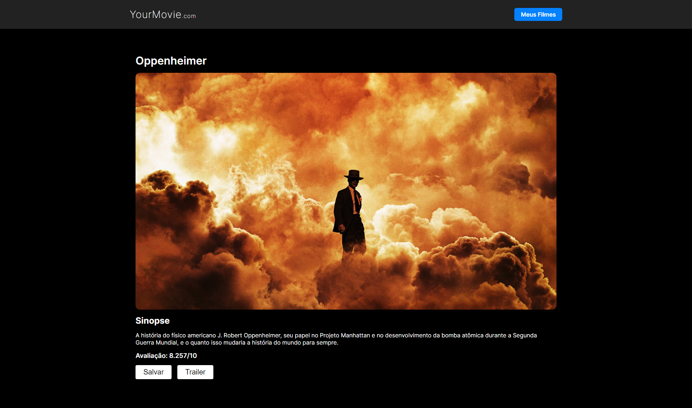
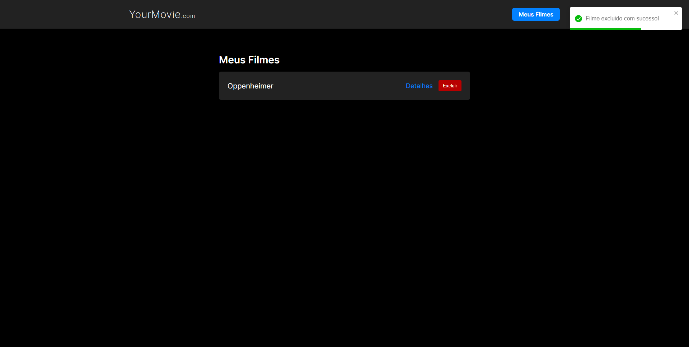

# YourMovie - Catálogo de Filmes

Este é um site responsivo de catálogo de filmes, os filmes mostrados são consumidos da API do The Movie database (TMDB);

Neste site é possível:

- Ver os 20 filmes mais populares no momento
- Ver detalhes do filme que deseja acessar
- Acessar o trailer do filme selecionado
- Adicionar e excluir filmes da sua lista de favoritos (os filmes adionados a sua lista ficam salvos no localStorage)

### Screenshot

### Links

- Repositório URL: [https://github.com/gbmouraa/catalogo_filmes](https://github.com/gbmouraa/catalogo_filmes)
- Live Site URL: [https://gbmoura-yourmovie.netlify.app/](https://gbmoura-yourmovie.netlify.app/)

### Site construído com

- [React](https://reactjs.org/) - JS library
- React Router
- Axios
- [Toastify](https://fkhadra.github.io/react-toastify/introduction) - Para as notificações do site

### O que eu aprendi

Este é um dos meus primeiros projetos em React, com certeza o mais complexo, foi um otimo exercício para aprimorar minha base em React.
Pude entender como funciona o react router dom, aprender um pouco mais sobre axios, localStorage e como usar bibliotecas externas em um projeto!
Estou satisfeito com o resultado e isso me motiva a aprender cada vez mais! :raised_hands: :ok_hand: :school_satchel:

## Author

- Frontend Mentor - [@gbmouraa](https://www.frontendmentor.io/profile/gbmouraa)
- Linkeding - [Gabriel Moura](https://www.linkedin.com/in/gabriel-moura-b63382161/)
